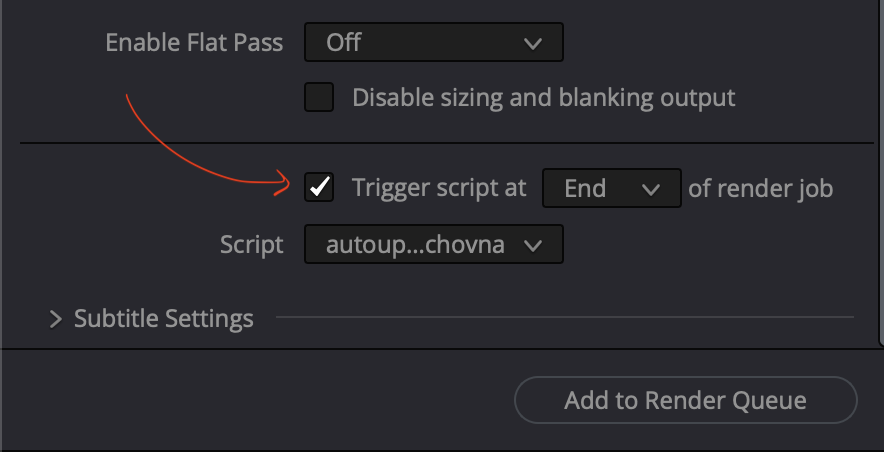

# Davinci Resolve autoupload

Do you hate waiting looong time for export to finish just to upload it straight to uschovna.cz?
I have a solution for you!

Davinci Resolve is able to trigger scripts before/after renders.
I used this to trigger a python script after finished render to upload the video using selenium directly to uschovna.cz.

Note: This script is tested on MacOS, other OS might require minor changes. (such as '*say*' command)

### How to set it up

1. Install python and selenium library.
2. Download [chrome driver](https://developer.chrome.com/docs/chromedriver/) of the same version as your browser and add the correct path to the driver in script.
3. Put this script into the **Deliver** folder of Davinci Resolve.
    > On Mac it is */Library/Application Support/Blackmagic Design/DaVinci Resolve/Fusion/Scripts/Deliver*
4. Replace the mail addresses, body text and filepath of the file to send to yours.
5. Go to Davinci **Deliver** tab, click on *Advanced Settings* in *Render settings* and check **Trigger script at end of render job**. Under the script choose the name of this script.

6. You're ready to go!

Benjamín Lapoš 2024
